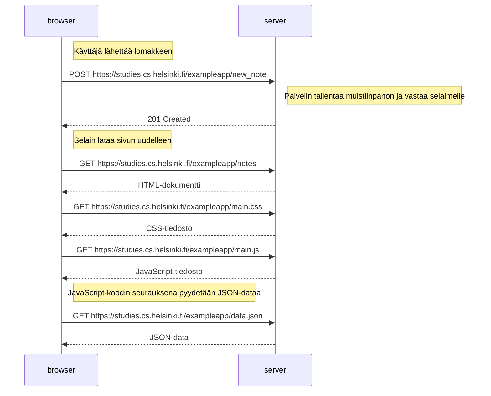

```mermaid
sequenceDiagram
    participant B as browser
    participant S as server

    Note right of B: Käyttäjä lähettää lomakkeen
    B ->> S: POST https://studies.cs.helsinki.fi/exampleapp/new_note
    Note right of S: Palvelin tallentaa muistiinpanon ja vastaa selaimelle
    S -->> B: 201 Created

    Note right of B: Selain lataa sivun uudelleen
    B ->> S: GET https://studies.cs.helsinki.fi/exampleapp/notes
    S -->> B: HTML-dokumentti

    B ->> S: GET https://studies.cs.helsinki.fi/exampleapp/main.css
    S -->> B: CSS-tiedosto

    B ->> S: GET https://studies.cs.helsinki.fi/exampleapp/main.js
    S -->> B: JavaScript-tiedosto

    Note right of B: JavaScript-koodin seurauksena pyydetään JSON-dataa
    B ->> S: GET https://studies.cs.helsinki.fi/exampleapp/data.json
    S -->> B: JSON-data

```