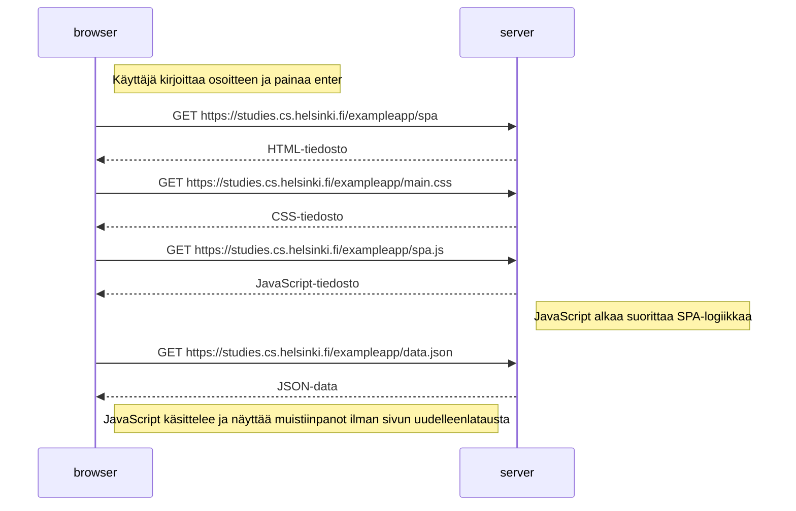

```mermaid
sequenceDiagram
    participant B as browser
    participant S as server

    Note right of B: Käyttäjä kirjoittaa osoitteen ja painaa enter
    B ->> S: GET https://studies.cs.helsinki.fi/exampleapp/spa
    S -->> B: HTML-tiedosto

    B ->> S: GET https://studies.cs.helsinki.fi/exampleapp/main.css
    S -->> B: CSS-tiedosto

    B ->> S: GET https://studies.cs.helsinki.fi/exampleapp/spa.js
    S -->> B: JavaScript-tiedosto

    Note right of S: JavaScript alkaa suorittaa SPA-logiikkaa

    B ->> S: GET https://studies.cs.helsinki.fi/exampleapp/data.json
    S -->> B: JSON-data

    Note right of B: JavaScript käsittelee ja näyttää muistiinpanot ilman sivun uudelleenlatausta

```