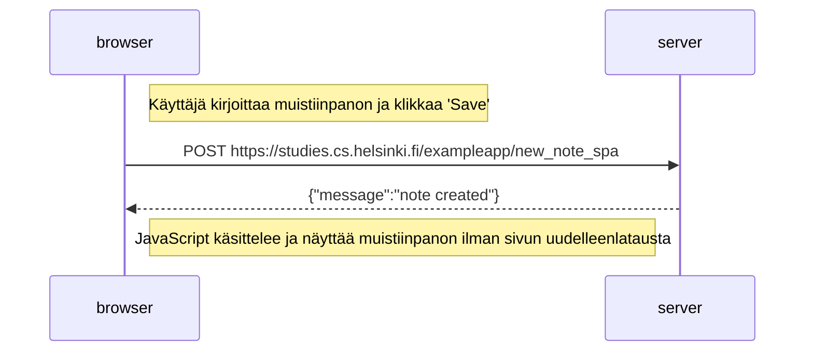

```mermaid
sequenceDiagram
    participant B as browser
    participant S as server

    Note right of B: Käyttäjä kirjoittaa muistiinpanon ja klikkaa 'Save'
    B ->> S: POST https://studies.cs.helsinki.fi/exampleapp/new_note_spa
    S -->> B: {"message":"note created"}

    Note right of B: JavaScript käsittelee ja näyttää muistiinpanon ilman sivun uudelleenlatausta

```